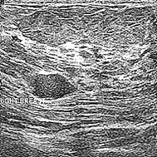
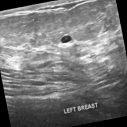

# Сравнение улучшений изображений

В этом примере показаны результаты обработки изображений с использованием двух различных методов улучшения:

1. **Оригинальное изображение**
2. **Улучшение с использованием CLAHE**
3. **Улучшение с использованием Zero-DCE**

## Изображения

<div style="display: flex; justify-content: space-around; text-align: center;">
    <figure style="width: 30%; height: auto;">
        
        <figcaption>Оригинал</figcaption>
    </figure>
    <figure style="width: 30%; height: auto;">
        
        <figcaption>CLAHE</figcaption>
    </figure>
    <figure style="width: 30%; height: auto;">
        
        <figcaption>Zero-DCE</figcaption>
    </figure>
</div>

## Quick Start
### Prerequisites
- Python  3.9.13
- CUDA 12.8

The pip package required to run the code is installed by executing the following command in the `src`: 
``` bash
python -m pip install -r requirements.txt
```

### Train
You can change the training data by modifying the pictures stored in `src/data/train_data`. 

Execute the following command to start training:
``` bash
python lowlight_train.py 
```

### Test
You can change the test data by modifying the pictures stored in `src/data/test_data`. The enhanced results are saved in `src/data/result`.

Execute the following command to start testing:
``` bash
python clahe_and_zero.py 
```


## Метрики
при num_epochs = 200 и train_batch_size = 8 и num_workers = 4.

| Метод    | MSE    | PSNR    | SSIM   |
|----------|--------|---------|--------|
| CLAHE    | 0.0145 | 18.4194 | 0.7299 |
| Zero-DCE | 0.0036 | 24.4896 | 0.9340 |
.

при num_epochs = 100 и train_batch_size = 8 и num_workers = 4.

| Метод    | MSE    | PSNR    | SSIM   |
|----------|--------|---------|--------|
| CLAHE    | 0.0145 | 18.4194 | 0.7299 |
| Zero-DCE | 0.0050 | 23.0327 | 0.9151 |
.

при num_epochs = 50 и train_batch_size = 8 и num_workers = 8.

| Метод    | MSE    | PSNR    | SSIM   |
|----------|--------|---------|--------|
| CLAHE    | 0.0145 | 18.4194 | 0.7299 |
| Zero-DCE | 0.0043 | 23.7371 | 0.9309 |
.

при num_epochs = 199 и train_batch_size = 4 и num_workers = 4. стандартный

| Метод    | MSE    | PSNR    | SSIM   |
|----------|--------|---------|--------|
| CLAHE    | 0.0145 | 18.4194 | 0.7299 |
| Zero-DCE | 0.0037 | 24.3467 | 0.9314 |

